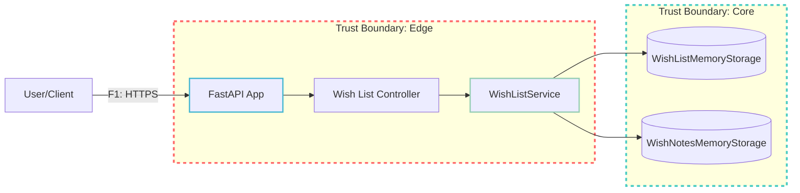

# DFD — Data Flow Diagram для Wish List Service

## Диаграмма (Mermaid)

## Список потоков
| ID | Откуда → Куда | Канал/Протокол | Данные/PII | Комментарий |
|----|---------------|-----------------|------------|-------------|
| F1 | U → API | HTTPS | JSON requests/responses | Основной API трафик |
| F2 | API → CTRL | Internal call | Request objects | Маршрутизация запросов |
| F3 | CTRL → SVC | Internal call | Domain models | Бизнес-логика |
| F4 | SVC → WISH_STORE | Internal call | WishList entities | CRUD операции wish list |
| F5 | SVC → NOTE_STORE | Internal call | WishNote entities | CRUD операции заметок |
| F6 | WISH_STORE → SVC | Internal call | WishList data | Возврат данных |
| F7 | NOTE_STORE → SVC | Internal call | WishNote data | Возврат данных |
| F8 | SVC → CTRL | Internal call | Response objects | Результаты обработки |
| F9 | CTRL → API | Internal call | HTTP responses | Формирование ответов |
| F10 | API → U | HTTPS | JSON responses | Ответы клиенту |

## Компоненты системы
- **User/Client**: Внешний пользователь, взаимодействующий с системой
- **FastAPI App**: Веб-приложение на FastAPI
- **Wish List Controller**: Контроллер для обработки HTTP запросов
- **WishListService**: Сервисный слой с бизнес-логикой
- **WishListMemoryStorage**: Хранилище списков желаний в памяти
- **WishNotesMemoryStorage**: Хранилище заметок в памяти

## Trust Boundaries
- **Edge Boundary**: Граница между внешним миром и внутренней системой
- **Core Boundary**: Граница между сервисным слоем и слоем данных
